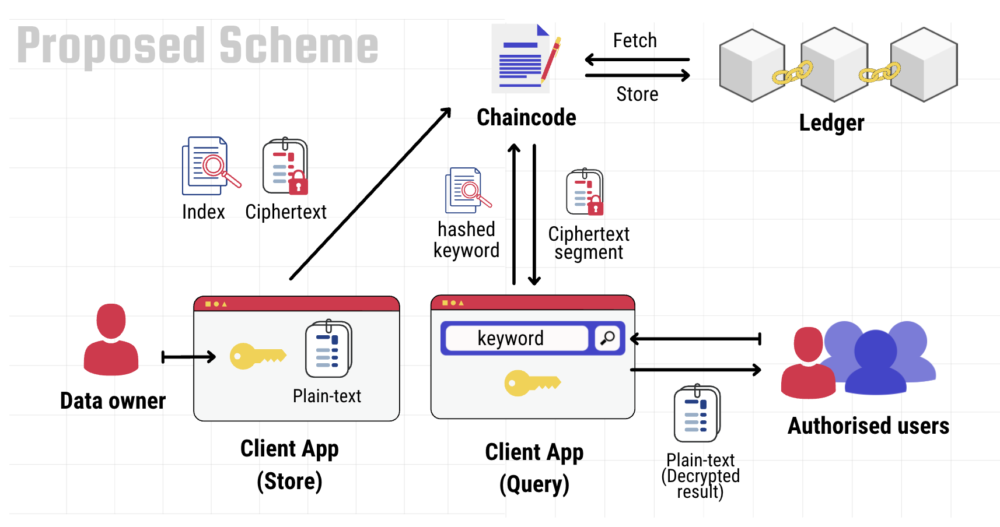

# Symertric Searchable Encryption Chaincode
SSE Chaincode contains the SSE contract (`SseContract` class), which is a program written in TypeScript and includes various transactions that facilitate storing and querying encrypted data through an index-based searchble encryption scheme bellow.



Despite the word state on fabric has good support for CouchDB and its query functionalities, the `SseContruct` is developed such that it only utilise the common functionalities between CouchDB and LevelDB; hence it support networks in which peers uses the simple key-value state database, i.e. LevelDB. The support for LevelDB was further motivated by the fact that the conversion from LevelDB to CouchDB is not possible in the current version of Hyperledger Fabric. Therefore, all the values of the secure index and the encrypted data-segments are stored as simple key-value records without any sophisticated data-modelling. A prefix for the record’s keys is then used to distinguish between an index record and an encrypted data-segment record; indeed, this is not a functional requirement, but it leads to a less cluttered database. In this implementation the index record’s key is prefixed with ix_ and the record’s key of an encrypted data-segment is prefixed with ct_ as an acronym for cipher-text.

An external application can either evaluate a transaction or submit it. This depends on the `@Transaction()` annotation prior to the transaction function’s signature within the `SseContract` class. If false is passed to the annotation `@Transaction(false)`, it defines an evaluated transaction, while passing a true or leaving it out, defines a submitted transaction (`@Transaction(true)` or `@Transaction()`);

# Demo
Through [this link](https://github.com/MahmoudRe/sse-app) you can find a full desktop application uses this Chaincode for secure data storing.

# API v1
```ts
@Transaction(false)
public async exists(ctx: Context, key: string): Promise<boolean>

@Transaction(false)
public async read(ctx: Context, key: string): Promise<string>

@Transaction()
public async write(ctx: Context, key: string, value: string)

@Transaction()
public async delete(ctx: Context, key: string)

...
```

The code-snippet above shows the basic transactions to interact with the ledger. Although they are not required to be exposed for the proposed SSE scheme, doing so facilitate more dynamic use of the contract and potential optimisation by the client application, for instance, caching the pointers of the encrypted segments locally, and using them to access and modify a specific segment directly. here the `write(...)` transaction can be used for both Create and Update operations. Note here that the first argument, `ctx: Context`, is supplied internally when the transaction is submitted from external application; hence the arguments to be passed here starts from the second argument and further. `ctx: Context` gives access to the state database in the context of the channel that this chaincode is executed on.

```ts
...

@Transaction()
public async storeEncryptedSegment(ctx: Context, segmentKey: string, segmentValue: string)

@Transaction()
public async updateEncryptedSegment(ctx: Context, segmentKey: string, segmentValue: string)

@Transaction()
public async deleteEncryptedSegment(ctx: Context, segmentKey: string)

@Transaction()
public async storeEncryptedSegments(ctx: Context, segmentsKeyStr: string, segmentsValueStr: string)

@Transaction()
public async storeEncryptedSegmentsJSON(ctx: Context, segmentsStringified: string)

...
```

Furthermore, the `SseContruct` provides transactions for CURD\footnote{Create, Update, Read, Update} operation for an encrypted segment. The segment refers here to a data-block, a single document, or a paragraph in a large text. These transaction ensures that any handling of the record's key is done before requesting the data, such as prefixing with `ct_`. 

The searching specificity is determined by the size of the encrypted segment. In other words, each segment, in some way, is considered as a search result, where the search query returns between $[0, n]$ segments, where $n$ is the total number of the stored encrypted segments. Dividing the data into segments is done by the client application, and then the segments get encrypted individually before submitting them through this contract. Both of `storeEncryptedSegments` and `storeEncryptedSegmentsJSON` can be used to store multiple encrypted segments at once. 

The non-JSON version, `storeEncryptedSegments`, accepts two arguments, in which the first argument is the stringified array of keys, and the second one is the stringified array of values. These arrays should be structured such that the `n`"th entry in the keys array corresponds to the `n`"th entry in the values array. 

As for the JSON version, `storeEncryptedSegmentsJSON`, it accepts a stringified array of JSON entries, each entry has `key` and `value` attributes; hence the passed argument looks something like this (before stringifing):
```json
[
    {
        "key": "POINTER-TO-THIS-SEGMENT",
        "value": "CIPHERTEXT!"
    },
    { ... },
    { ... },
    ...
]
```

```ts
...

@Transaction()
public async addToIndex(ctx: Context, indexHash: string, indexPointersStr: string)

@Transaction()
public async removeFromIndex(ctx: Context, indexHash: string, indexPointersStr: string)

@Transaction()
public async addToIndices(ctx: Context, indicesHashsStr: string, indicesPointersStr: string)

@Transaction()
public async addToIndicesJSON(ctx: Context, indicesStringified: string)

...
```

In this code-snippet the transactions of adding index and store it on the world state database. The naming of these transaction is chosen to be `addTo`/`removeFrom` instead of using `store`/`delete` as in the case of encrypted segment, because an index is likely to be existed from previous storing operation, and therefore the index is updated each time a new encrypted data is stored or deleted; hence index value, i.e. pointers array, is either add to or removed from.

Please note that the second arguments by `addToIndex` and `removeFromIndex` transactions are a stringified arrays since each hashed search query/keyword, i.e. trapdoor, has pointers to all the encrypted segments that refers to it.

Similar to the `encryptedSegment` interface, `addToIndices` and `addToIndicesJSON` transactions are used to store multiple records of secure index table at once. In case of `addToIndicesJSON`, the shape of the stringified JSON arguemnt is as follow:

```json
[
    {
        "hash": "HASHED-KEYWORD",
        "pointers": ["POINTER-TO-SEGMENT-1", "POINTER-TO-SEGMENT-3", ... ]
    },
    { ... },
    ...
]
```


```ts
...

@Transaction()
public async store(ctx: Context, segmentsKey: string, segmentsValue: string, indicesHashs: string, indicesPointers: string)

@Transaction()
public async storeJSON(ctx: Context, segmentsStringified: string, indicesStringified: string)

@Transaction()
public async search(ctx: Context, indexHash: string): Promise<string[]>
```

Finally, the high-level functions/transactions shown in this snippet are the needed by the client application for basic SSE . `store` and `storeJSON` transactions are used for storing segments and the secure index. All the arguments of `store` are stringified array of strings, expect the `indicesPointers` argument which is a stringified 2-dimentaional array of strings. With respect to `storeJSON`, the row arguments are stringified JSON which are arrays of indices and encrypted segments, where the shape of the index or the encrypted segment entry is the same as previously mentioned by `addToIndicesJSON` and `storeEncryptedSegmentsJSON`.

As for `search` transaction, given a trapdoor, i.e. hashed search query (index), it returns list of segments that associated with given the trapdoor.